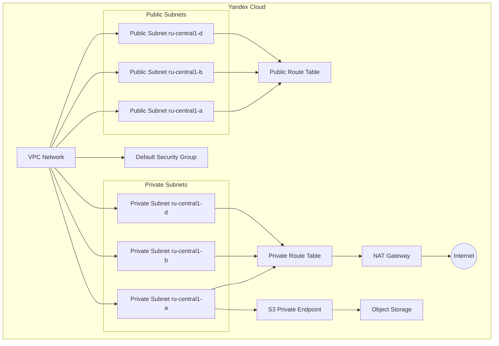

# Virtual Private Cloud (VPC) Terraform module for Yandex.Cloud

## Features

- **Create Network and subnets in your folder**
- **Supports MultiFolder VPC concept by adding folder_id to subnet object**
- **Subnets can be both public for VMs with public IPs and private, with or without NAT gateway**
- **Create private endpoint for Object Storage**
- **Create default security group**
- **Easy to use in other resources via outputs**


### When planning your VPC CIDR blocks, consider:

1. **Future Growth**: Choose CIDR blocks that allow for future expansion
2. **Non-Overlapping Ranges**: Ensure CIDR blocks don't overlap with other networks
3. **Consistent Sizing**: Use consistent subnet sizes for similar resources

### Security Recommendations

1. **Restrict Access**: Limit access to resources in private subnets
2. **Use NAT Gateway**: For outbound internet access from private subnets
3. **Custom Security Groups**: Create additional security groups for specific workloads with module for [SG](https://github.com/terraform-yandex-cloud-modules/terraform-yc-security-group)

### Common Issues

1. **CIDR Block Conflicts**: Ensure CIDR blocks don't overlap with existing networks
2. **Folder Permissions**: Verify proper permissions for multi-folder deployments

### How to Configure Terraform for Yandex.Cloud

- Install [YC CLI](https://cloud.yandex.com/docs/cli/quickstart)
- Add environment variables for terraform authentication in Yandex.Cloud

```
export YC_TOKEN=$(yc iam create-token)
export YC_CLOUD_ID=$(yc config get cloud-id)
export YC_FOLDER_ID=$(yc config get folder-id)
```

### Basic VPC Architecture

<!-- BEGINNING OF PRE-COMMIT-TERRAFORM DOCS HOOK -->
## Requirements

| Name | Version |
|------|---------|
| <a name="requirement_terraform"></a> [terraform](#requirement\_terraform) | >= 1.0.0 |
| <a name="requirement_yandex"></a> [yandex](#requirement\_yandex) | >= 0.101.0 |

## Providers

| Name | Version |
|------|---------|
| <a name="provider_yandex"></a> [yandex](#provider\_yandex) | 0.140.1 |

## Modules

No modules.

## Resources

| Name | Type |
|------|------|
| [yandex_vpc_default_security_group.default_sg](https://registry.terraform.io/providers/yandex-cloud/yandex/latest/docs/resources/vpc_default_security_group) | resource |
| [yandex_vpc_gateway.egress_gateway](https://registry.terraform.io/providers/yandex-cloud/yandex/latest/docs/resources/vpc_gateway) | resource |
| [yandex_vpc_network.this](https://registry.terraform.io/providers/yandex-cloud/yandex/latest/docs/resources/vpc_network) | resource |
| [yandex_vpc_private_endpoint.object_storage](https://registry.terraform.io/providers/yandex-cloud/yandex/latest/docs/resources/vpc_private_endpoint) | resource |
| [yandex_vpc_route_table.private](https://registry.terraform.io/providers/yandex-cloud/yandex/latest/docs/resources/vpc_route_table) | resource |
| [yandex_vpc_route_table.public](https://registry.terraform.io/providers/yandex-cloud/yandex/latest/docs/resources/vpc_route_table) | resource |
| [yandex_vpc_subnet.private](https://registry.terraform.io/providers/yandex-cloud/yandex/latest/docs/resources/vpc_subnet) | resource |
| [yandex_vpc_subnet.public](https://registry.terraform.io/providers/yandex-cloud/yandex/latest/docs/resources/vpc_subnet) | resource |
| [yandex_client_config.client](https://registry.terraform.io/providers/yandex-cloud/yandex/latest/docs/data-sources/client_config) | data source |

## Inputs

| Name | Description | Type | Default | Required |
|------|-------------|------|---------|:--------:|
| <a name="input_create_nat_gw"></a> [create\_nat\_gw](#input\_create\_nat\_gw) | Create a NAT gateway for internet access from private subnets | `bool` | `true` | no |
| <a name="input_create_sg"></a> [create\_sg](#input\_create\_sg) | Shows whether а security group for VCP object should be created | `bool` | `true` | no |
| <a name="input_create_vpc"></a> [create\_vpc](#input\_create\_vpc) | Shows whether a VCP object should be created. If false, an existing `vpc_id` is required. | `bool` | `true` | no |
| <a name="input_domain_name"></a> [domain\_name](#input\_domain\_name) | Domain name to be added to DHCP options | `string` | `"internal."` | no |
| <a name="input_domain_name_servers"></a> [domain\_name\_servers](#input\_domain\_name\_servers) | Domain name servers to be added to DHCP options. Only ip addresses can be used | `list(string)` | `[]` | no |
| <a name="input_folder_id"></a> [folder\_id](#input\_folder\_id) | Folder ID where the resources will be created | `string` | `null` | no |
| <a name="input_labels"></a> [labels](#input\_labels) | Set of key/value label pairs to assign. | `map(string)` | <pre>{<br/>  "created_by": "terraform-yc-module"<br/>}</pre> | no |
| <a name="input_network_description"></a> [network\_description](#input\_network\_description) | Optional description of this resource. Provide this property when you create the resource. | `string` | `"terraform-created"` | no |
| <a name="input_network_name"></a> [network\_name](#input\_network\_name) | Prefix to be used with all the resources as an identifier | `string` | n/a | yes |
| <a name="input_ntp_servers"></a> [ntp\_servers](#input\_ntp\_servers) | NTP Servers for subnets. Only ip addresses can be used | `list(string)` | `[]` | no |
| <a name="input_private_subnets"></a> [private\_subnets](#input\_private\_subnets) | "Describe your private subnet preferences. For VMs without public IPs but with or without NAT gateway. For Multi-Folder VPC add folder\_id to subnet object"<br/>  private\_subnets = [<br/>  {<br/>    "v4\_cidr\_blocks" : ["10.221.0.0/16"],<br/>    "zone" : "ru-central1-a"<br/>    "description" : "Custom private-subnet description"<br/>    "name" : "Custom private-subnet name"<br/>  },<br/>  {<br/>    "v4\_cidr\_blocks" : ["10.231.0.0/16"],<br/>    "zone" : "ru-central1-b"<br/>    "folder\_id" : "xxxxxxx" # For Multi-Folder VPC<br/>  },<br/>  ] | <pre>list(object({<br/>    v4_cidr_blocks = list(string)<br/>    zone           = string<br/>    description    = optional(string)<br/>    name           = optional(string)<br/>    folder_id      = optional(string)<br/>  }))</pre> | `null` | no |
| <a name="input_public_subnets"></a> [public\_subnets](#input\_public\_subnets) | "Describe your public subnet preferences. For VMs with public IPs. For Multi-Folder VPC add folder\_ids to subnet objects"<br/>  Example:<br/>  public\_subnets = [<br/>  {<br/>    "v4\_cidr\_blocks" : ["10.121.0.0/16", "10.122.0.0/16"],<br/>    "zone" : "ru-central1-a"<br/>    "description" : "Custom public-subnet description"<br/>    "name" : "Custom public-subnet name"<br/>  },<br/>  {<br/>    "v4\_cidr\_blocks" : ["10.131.0.0/16"],<br/>    "zone" : "ru-central1-b"<br/>    "folder\_id" : "xxxxxxx" # For Multi-Folder VPC<br/>  },<br/>  ] | <pre>list(object({<br/>    v4_cidr_blocks = list(string)<br/>    zone           = string<br/>    description    = optional(string)<br/>    name           = optional(string)<br/>    folder_id      = optional(string)<br/>  }))</pre> | `null` | no |
| <a name="input_routes_private_subnets"></a> [routes\_private\_subnets](#input\_routes\_private\_subnets) | Describe your route preferences for public subnets | <pre>list(object({<br/>    destination_prefix = string<br/>    next_hop_address   = string<br/>  }))</pre> | `null` | no |
| <a name="input_routes_public_subnets"></a> [routes\_public\_subnets](#input\_routes\_public\_subnets) | Describe your route preferences for public subnets | <pre>list(object({<br/>    destination_prefix = string<br/>    next_hop_address   = string<br/>  }))</pre> | `null` | no |
| <a name="input_s3_private_endpoint"></a> [s3\_private\_endpoint](#input\_s3\_private\_endpoint) | Configuration for creating a private endpoint for Yandex Object Storage. When enabled, creates a secure connection to Object Storage without going through the public internet. Specify a subnet CIDR block and an IP address for the endpoint from one of the 'privite subnet's CIDR block'. | <pre>object({<br/>    enable                      = optional(bool, false)<br/>    private_dns_records_enabled = optional(bool, true)<br/>    subnet_v4_cidr_block        = optional(string, null)<br/>    address                     = optional(string, null)<br/>    }<br/>  )</pre> | `{}` | no |
| <a name="input_vpc_id"></a> [vpc\_id](#input\_vpc\_id) | Existing `network_id` (`vpc-id`) where resources will be created | `string` | `null` | no |

## Outputs

| Name | Description |
|------|-------------|
| <a name="output_private_subnets"></a> [private\_subnets](#output\_private\_subnets) | Map of private subnets: `key = first v4_cidr_block` |
| <a name="output_private_v4_cidr_blocks"></a> [private\_v4\_cidr\_blocks](#output\_private\_v4\_cidr\_blocks) | List of `v4_cidr_blocks` used in the VPC network |
| <a name="output_public_subnets"></a> [public\_subnets](#output\_public\_subnets) | Map of public subnets: `key = first v4_cidr_block` |
| <a name="output_public_v4_cidr_blocks"></a> [public\_v4\_cidr\_blocks](#output\_public\_v4\_cidr\_blocks) | List of `v4_cidr_blocks` used in the VPC network |
| <a name="output_vpc_id"></a> [vpc\_id](#output\_vpc\_id) | ID of the created network for internal communications |
<!-- END OF PRE-COMMIT-TERRAFORM DOCS HOOK -->
